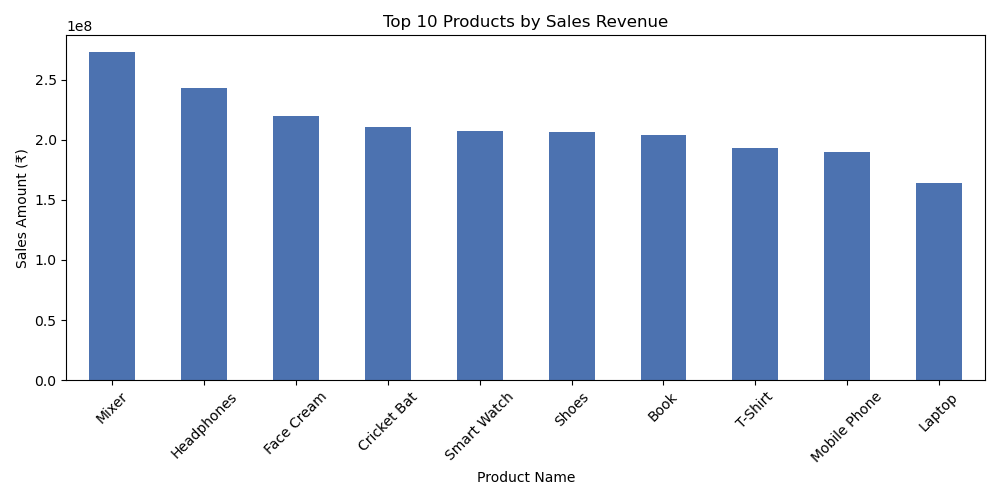
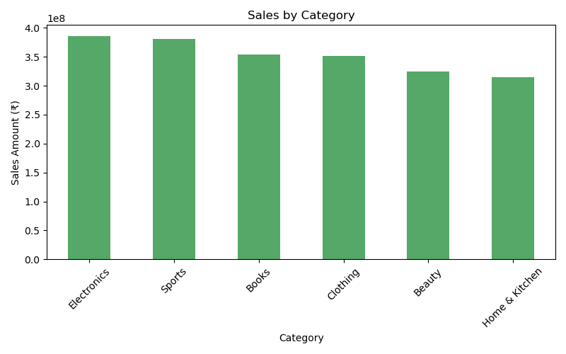
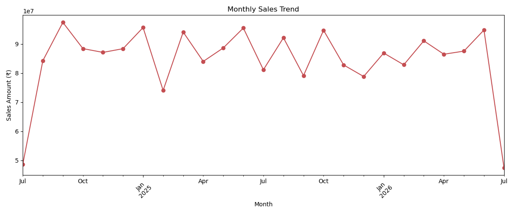
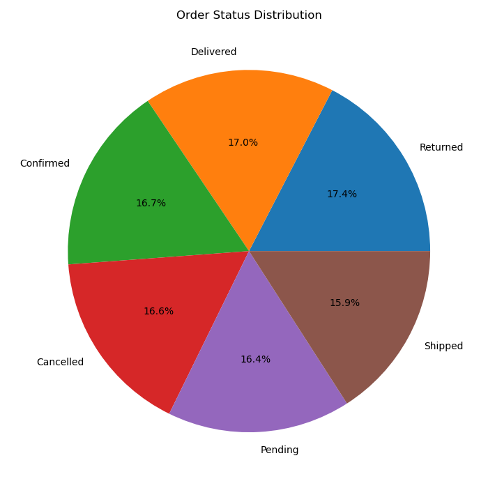
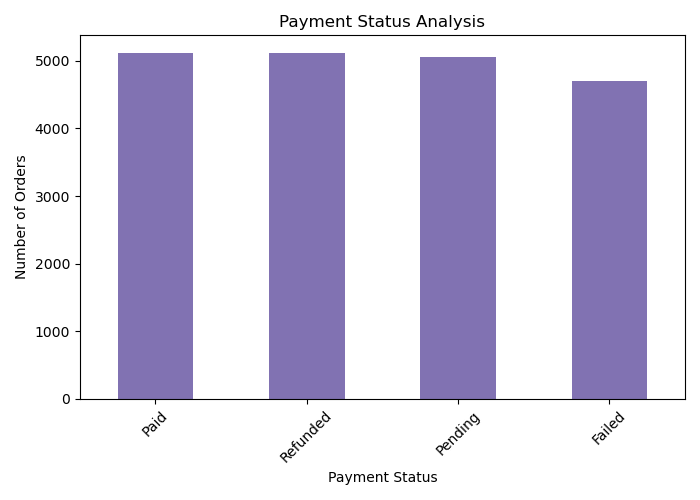
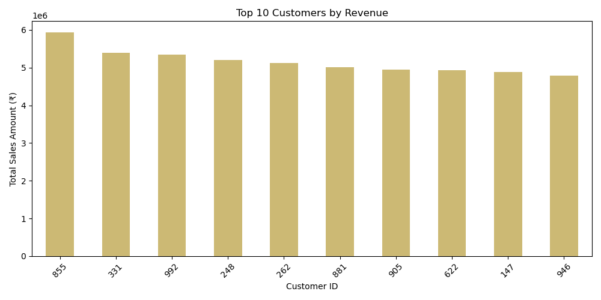

<div align="center">

# 🛒 E-Commerce Sales Analysis

### End-to-end sales analytics project using Python & SQL

*Synthetic data generation → SQL querying → Python analysis → Visualization → Business insights*

**Built with:** Python · Pandas · NumPy · Matplotlib · Faker · MySQL

</div>

---

## Table of Contents

- [Overview](#overview)
- [Dataset](#dataset)
- [Key Insights](#key-insights)
- [Visualizations](#visualizations)
- [SQL Analysis](#sql-analysis)
- [Project Structure](#project-structure)
- [How to Run](#how-to-run)
- [Next Steps](#next-steps)
- [Author](#author)

---

## Overview

Online retailers generate huge volumes of transactional data every day. This project simulates a realistic e-commerce dataset — customers, products, orders, and order line items — and analyzes it with **both Python (Pandas)** and **SQL (MySQL)** to answer key business questions:

- Who are the top revenue-generating customers and products?
- Which product categories perform best?
- How does revenue trend over time?
- What share of orders are cancelled, returned, or have failed payments?

The goal is to demonstrate a complete analytics workflow, from raw data to actionable business insight, using the two tools most commonly required in data analyst roles.

---

## Dataset

A synthetic e-commerce dataset was generated using the `Faker` library to simulate realistic transactions.

| Table | Rows | Description |
|---|---|---|
| `customers` | 1,000 | Name, contact info, city/state, signup date |
| `products` | 1,000 | Name, category, price, stock, rating |
| `orders` | 10,000 | Order date, status, payment status, total amount |
| `order_details` | 20,000 | Line items with quantity, discount, sales amount |

> This dataset is synthetically generated for demonstration and portfolio purposes. It does not represent real transactions or customers.

---

## Key Insights

| Metric | Value |
|---|---|
| Total Revenue | ₹211.2 crore |
| Total Orders | 10,000 |
| Average Order Value | ₹2,43,157 |
| Cancelled / Returned Orders | ~33% of all orders |
| Top Customer Spend | ₹59+ lakh |

**What the data shows:**

- **Category performance** is fairly balanced — Electronics leads, but the top and bottom categories are within ~20% of each other, so no single category dominates revenue.
- **Order fulfilment health** is a concern: roughly **1 in 3 orders** end up `Cancelled` or `Returned`, which in a real business would warrant investigating fulfilment quality or product accuracy.
- **Payment friction** exists — `Pending`, `Refunded`, `Paid`, and `Failed` statuses are each roughly a quarter of orders, meaning a meaningful share of revenue is not yet realized and could potentially be recovered.
- **Revenue is moderately concentrated** among top customers, reinforcing the value of loyalty and retention efforts for high-value buyers.

---

## Visualizations

<table>
<tr>
<td width="50%">

**Top 10 Products by Revenue**


</td>
<td width="50%">

**Revenue by Category**


</td>
</tr>
<tr>
<td width="50%">

**Monthly Sales Trend**


</td>
<td width="50%">

**Order Status Distribution**


</td>
</tr>
<tr>
<td width="50%">

**Payment Status Analysis**


</td>
<td width="50%">

**Top 10 Customers by Revenue**


</td>
</tr>
</table>

---

## SQL Analysis

`sql/ecommerce_analysis_queries.sql` contains the full database schema and 11 business analysis queries, including:

- Total revenue, orders, and average order value
- Top 10 products by revenue and by units sold
- Top 10 customers by total spend
- Revenue by category
- Monthly sales trend
- Order status and payment status distribution
- Customers who signed up but never placed an order

---

## Project Structure

```
E-Commerce-Sales-Analysis/
│
├── dataset/                                   # Generated CSV datasets
│   ├── customers.csv
│   ├── products.csv
│   ├── orders.csv
│   └── order_details.csv
│
├── notebooks/
│   └── Ecommerce_Sales_Analysis.ipynb          # Full analysis notebook
│
├── sql/
│   └── ecommerce_analysis_queries.sql          # Schema + business analysis queries
│
├── images/                                     # Exported chart images
│   ├── 01_top_10_products_sales_revenue.png
│   ├── 02_sales_by_category.png
│   ├── 03_monthly_sales_trend.png
│   ├── 04_order_status_distribution.png
│   ├── 05_payment_status_analysis.png
│   └── 06_top_customers_revenue.png
│
├── requirements.txt
└── README.md
```

---

## How to Run

**1. Clone the repository**
```bash
git clone https://github.com/GauravBisen15/Ecommerce-Sales-Analysis.git
cd Ecommerce-Sales-Analysis
```

**2. Install dependencies**
```bash
pip install -r requirements.txt
```

**3. Run the notebook**
```bash
jupyter lab notebooks/Ecommerce_Sales_Analysis.ipynb
```
Run all cells to regenerate the dataset, compute metrics, and produce all charts in `images/`.

**4. (Optional) Load data into MySQL**
```bash
mysql -u root -p < sql/ecommerce_analysis_queries.sql
```
Uncomment the `LOAD DATA LOCAL INFILE` statements in the script and update the file paths to load the generated CSVs into the database.

---

## Next Steps

- Build an interactive dashboard (Power BI / Tableau / Streamlit) on top of the analysis
- Add cohort and customer lifetime value (CLV) analysis for deeper customer insights
- Automate PDF/HTML report generation from the notebook

---

<div align="center">

## Author

**Gaurav Bisen**

[GitHub](https://github.com/GauravBisen15)

</div>
